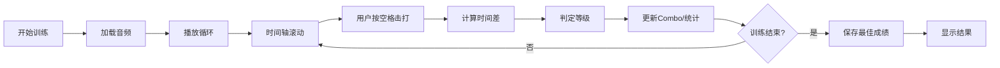

## 1. 产品概述

锣鼓经松紧击打时序偏差训练系统，为民乐排练室学员提供打击乐节奏精准度练习。通过播放参考音频循环，学员使用空格键跟随节奏击打，系统实时计算击打与参考时刻的时间差并给出评分。

- 目标用户：民乐打击乐学员、排练室训练者
- 核心价值：量化节奏偏差，提升击打精准度，支持自主练习

## 2. 核心功能

### 2.1 功能模块

1. **训练主页**：音频控制、击打判定、实时反馈、统计展示
2. **时间轴可视化**：显示参考击打时刻、用户击打位置、偏差指示
3. **评分系统**：perfect/good/miss 三级判定、combo 连击、平均偏差统计
4. **成绩存储**：localStorage 保存最佳成绩

### 2.3 页面详情

| 页面名称 | 模块名称 | 功能描述 |
|-----------|-------------|---------------------|
| 训练主页 | 音频控制区 | 播放/暂停按钮、循环状态指示、音量调节 |
| 训练主页 | 时间轴组件 | 可视化显示参考节拍点、播放进度、用户击打标记 |
| 训练主页 | 实时反馈区 | 显示每次击打判定结果（perfect/good/miss）、偏差毫秒数 |
| 训练主页 | 统计面板 | 当前 combo、最高 combo、平均偏差、最佳成绩 |

## 3. 核心流程

用户点击「开始训练」按钮 → 加载并播放 `luogu-a.ogg` 音频循环 → 时间轴实时滚动显示参考节拍点 → 用户在标记时刻按下空格键 → 系统捕获击打时间并与参考时刻比较 → 显示判定结果和偏差值 → 更新 combo 和统计数据 → 训练结束后保存最佳成绩到 localStorage。

## 4. 用户界面设计

### 4.1 设计风格

- **主色调**：深色背景（#1a1410），搭配朱砂红（#c41e3a）作为主强调色，鎏金色（#d4af37）作为次要强调色
- **按钮风格**：圆角矩形，悬停时有微缩放和发光效果，按压有下沉反馈
- **字体**：标题使用具有传统韵味的衬线字体，正文使用清晰的无衬线字体
- **布局风格**：居中对称布局，时间轴占据视觉中心，统计面板分布两侧
- **视觉元素**：融入传统锣鼓纹样的装饰性边框和分隔线

### 4.2 页面设计概述

| 页面名称 | 模块名称 | UI 元素 |
|-----------|-------------|-------------|
| 训练主页 | 音频控制区 | 大型播放按钮、进度条、循环指示图标 |
| 训练主页 | 时间轴组件 | 横向滚动时间轴、节拍点标记、播放位置指示线、击打反馈动画 |
| 训练主页 | 实时反馈区 | 大号判定文字动画、偏差数值显示 |
| 训练主页 | 统计面板 | 卡片式布局、数值渐变动画、最佳成绩徽章 |

### 4.3 响应式

- 桌面端优先设计，时间轴宽度自适应
- 移动端适配：统计面板改为纵向排列，时间轴触控友好
- 空格键操作支持键盘，移动端支持屏幕大按钮击打
