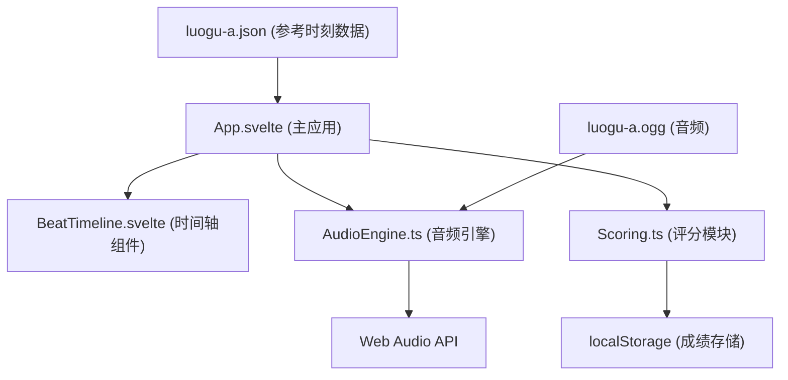

## 1. 架构设计

纯前端单页应用，无后端依赖。采用模块化架构，分离音频引擎、评分逻辑和 UI 组件。



## 2. 技术描述

- **前端框架**：Svelte 5 + Vite 6 + TypeScript
- **音频处理**：Web Audio API（AudioBufferSourceNode、GainNode）
- **状态管理**：Svelte 5 Runes（$state、$derived、$effect）
- **数据存储**：localStorage
- **样式方案**：Scoped CSS + CSS 变量

## 3. 目录结构

```
├── public/
│   └── loops/
│       └── luogu-a.ogg          # 参考音频文件
├── src/
│   ├── components/
│   │   └── BeatTimeline.svelte  # 时间轴可视化组件
│   ├── data/
│   │   └── luogu-a.json         # 参考击打时刻数组（毫秒）
│   ├── engine/
│   │   ├── AudioEngine.ts       # Web Audio 封装
│   │   └── Scoring.ts           # 评分逻辑
│   ├── App.svelte               # 主应用组件
│   ├── main.ts                  # 入口文件
│   └── app.css                  # 全局样式
├── Dockerfile                   # Docker 配置
├── nginx.conf                   # Nginx 配置
├── package.json
├── tsconfig.json
└── vite.config.ts
```

## 4. 核心模块定义

### 4.1 AudioEngine.ts

```typescript
interface AudioEngine {
  loadAudio(url: string): Promise<void>;
  startLoop(): void;
  stopLoop(): void;
  getCurrentTime(): number;  // 返回当前播放位置（毫秒）
  isPlaying: boolean;
  onBeat: (time: number) => void;  // 节拍回调
}
```

### 4.2 Scoring.ts

```typescript
type JudgeResult = 'perfect' | 'good' | 'miss';

interface HitResult {
  referenceTime: number;
  hitTime: number;
  delta: number;
  judge: JudgeResult;
}

interface ScoringStats {
  combo: number;
  maxCombo: number;
  perfectCount: number;
  goodCount: number;
  missCount: number;
  averageDelta: number;
}

interface Scoring {
  registerHit(hitTime: number, referenceTimes: number[]): HitResult | null;
  getStats(): ScoringStats;
  reset(): void;
  saveBestScore(stats: ScoringStats): void;
  loadBestScore(): ScoringStats | null;
}
```

### 4.3 BeatTimeline.svelte Props

```typescript
interface BeatTimelineProps {
  referenceBeats: number[];      // 参考时刻数组（毫秒）
  currentTime: number;           // 当前播放位置（毫秒）
  duration: number;              // 音频总时长（毫秒）
  hitResults: HitResult[];       // 击打结果历史
}
```

## 5. 判定规则

| 判定 | 时间差范围 | 颜色 |
|------|-----------|------|
| perfect | \|Δt\| ≤ 40ms | 鎏金色 #d4af37 |
| good | 40ms < \|Δt\| ≤ 90ms | 青绿色 #2ecc71 |
| miss | \|Δt\| > 90ms | 朱砂红 #c41e3a |

## 6. Docker 配置

- 基础镜像：`node:20-alpine`（构建阶段）
- 运行镜像：`nginx:alpine`
- 端口映射：8080 → 80
- 构建流程：`npm run build` → 复制 `dist` 目录到 nginx
